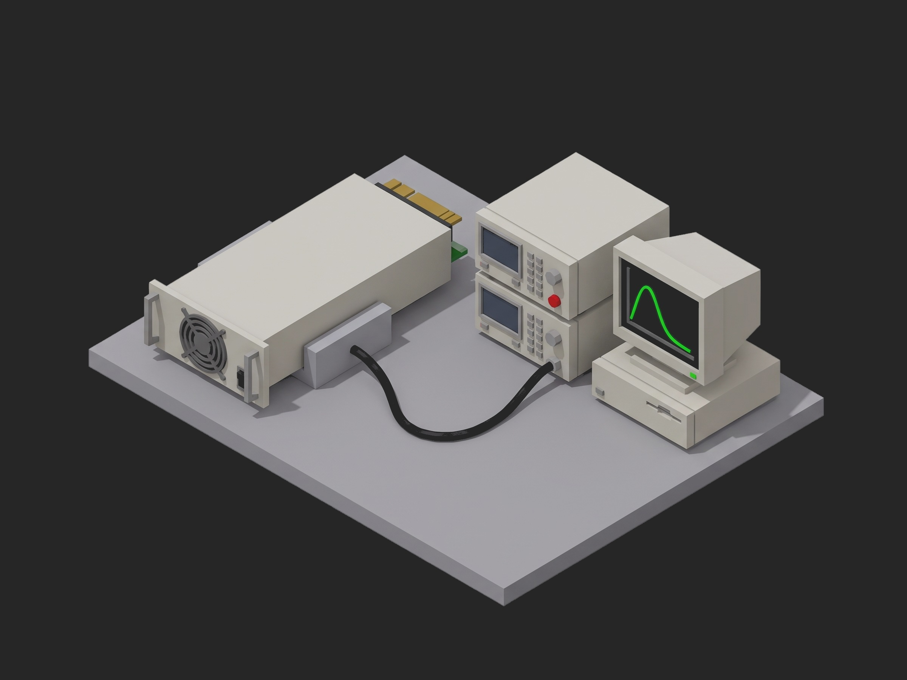

# Framework ORV3 PSU Acceptance Test



A TofuPilot Framework procedure for the acceptance of an OCP Open Rack V3 HPR 12 kW power supply module: hipot and ground bond before AC is ever applied, identity and serial read over Modbus, cold-start inrush at the 90 degree phase angle, the efficiency curve at 230 and 277 Vac against the ORV3 floor and the 80 PLUS Titanium points with the output-current telemetry checked against the load, ripple and the 70 to 130 percent load step, hold-up at 100 and 120 percent load with the AC_Loss_L lead the rack needs to shed load, OVP, OCP, OTW and OTP trips in test mode, and a teardown that reads the blackbox, requires it to hold exactly the events the test caused, and clears it. The mock bench synthesizes a healthy module with Titanium-class efficiency peaking at 50 percent load and 7.2 mF of bulk capacitance.

## What This Shows

| Feature | Where |
|---------|-------|
| `setup:` as a safety gate: hipot and bond run with the AC source off, and `identify` waits for them | `depends_on: [hipot_and_bond]` in `procedure.yaml` |
| Multi-dimensional measurement with three curves and a different aggregation set on each | `efficiency` -- `eff_277` / `eff_230` (`min_30_100_pct`, `min_10_30_pct`, `peak_pct`), `iout_telemetry_err_pct` (`max_abs_pct`) |
| Limits as the spec states them: a stair floor, a peak, a table of hold-up times per load | `>= 94.0` below 30 % and `>= 96.5` above, `>= 97.5` peak, `20 ms` / `16.67 ms` |
| Waveforms recorded whole, judged on one number | `inrush` (`peak_a`, `first_cycle_rms_a`), `load_step` (`min_v`, `settle_ms`), `hold_up` (`hold_up_ms`) |
| JSON `==` on a whole object, three times | `psu_identity`, `blackbox_after_test`, `blackbox_after_clear` |
| String `matches` and a boolean that compares the reported serial with the scanned one | `reported_serial`, `serial_matches_label` |
| A `timeout` sized for the spec's 30 min warm-up, a sequential `depends_on` chain on one load and one source | `timeout: 45m`, `depends_on` on every main phase |
| `teardown:` that always parks the load and the source | `phases/blackbox_and_park.py` |

## Get Started

1. Sign up for a free TofuPilot account at [tofupilot.app](https://www.tofupilot.app/auth/signup).
2. Open the **New Procedure** flow in the dashboard and clone this template.
3. Follow the dashboard's instructions to set up a station and run the procedure.

For deeper guides, see the [TofuPilot docs](https://www.tofupilot.com/docs/framework) and the [ORV3 PSU Acceptance Test template page](https://www.tofupilot.com/templates/orv3-psu-acceptance-test).

## Structure

```
.
├── procedure.yaml                    # Procedure, plug, phases, measurements
├── phases/
│   ├── hipot_and_bond.py             # Setup: 2121 Vdc withstand and 40 A bond, AC off
│   ├── identify.py                   # Setup: model, firmware, serial over Modbus, no-load output
│   ├── inrush.py                     # Cold start at 90 degrees, peak and first-cycle RMS
│   ├── efficiency.py                 # Six load points at 230 and 277 Vac, telemetry error
│   ├── ripple_and_transient.py       # Ripple at 20 MHz, 70 to 130 % step both ways
│   ├── hold_up.py                    # AC loss at 100 and 120 %, AC_Loss_L margin
│   ├── protections.py                # OVP by trim, OCP by load ramp, OTW/OTP by override
│   └── blackbox_and_park.py          # Teardown: blackbox checked and cleared, load off, AC off
├── plugs/
│   └── psu_bench.py                  # Mock AC source + load + analyzer + hipot + scope + Modbus
├── utils/
│   └── recipe.py                     # Ratings, stimulus, where each limit comes from
├── pyproject.toml                    # uv-managed Python project
└── README.md
```

## Replace the Mock with Real Hardware

`plugs/psu_bench.py` maps to six links: the AC source over SCPI (Chroma 61512 or Pacific Power 3120AFX, with phase-angle start for the inrush), the 12 kW DC electronic load over SCPI (Chroma 63200A series, with the 3 A/us slew for the load step), the power analyzer (Yokogawa WT5000) for input and output power, the hipot and ground-bond tester (Chroma 19032) driven before the AC source is enabled, a scope on the output and on the inrush CT, and the PSU's Modbus port through a USB-RS485 adapter with pymodbus for identity, telemetry, the test-mode trim and thermistor override, faults and the blackbox. Time the AC_Loss_L edge and the OVP response on the scope, not on a polled register. The phases, measurements and limits stay the same.
